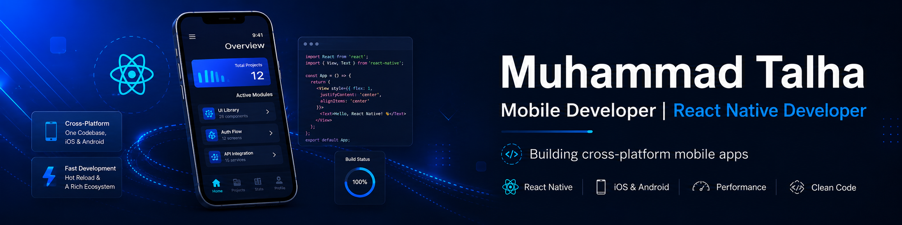

  

# Hey, I'm Muhammad Talha 👋

### Mobile Developer | React Native Developer

---

## 🛠 Tech Stack

### Mobile Development

  
  

### Frontend

  
  
  
  
  

### Backend & APIs

  
  
  
  

### Databases & Cloud

  
  
  
  

### Tools & Platforms

  
  
  
  
  
  

### AI Tools

  
  
  
  
  
  

---

## 📱 What I Like Building

* Cross-platform Android & iOS apps
* React Native mobile apps with clean UI
* Firebase-powered real-time features
* API-connected mobile applications
* Authentication, dashboards, chat, notifications, and booking flows
* Web apps and backend-connected systems

---

📊 GitHub Stats

---

## 🤝 Connect With Me

[LinkedIn](https://www.linkedin.com/in/muhammad-talha-tahir-a36844179)
[GitHub](https://github.com/talhaansari77)
📧 [codewithtalha@gmail.com](mailto:codewithtalha@gmail.com)

---

⚡ Personal Motto

Keep learning, keep building, and turn ideas into useful digital products.
